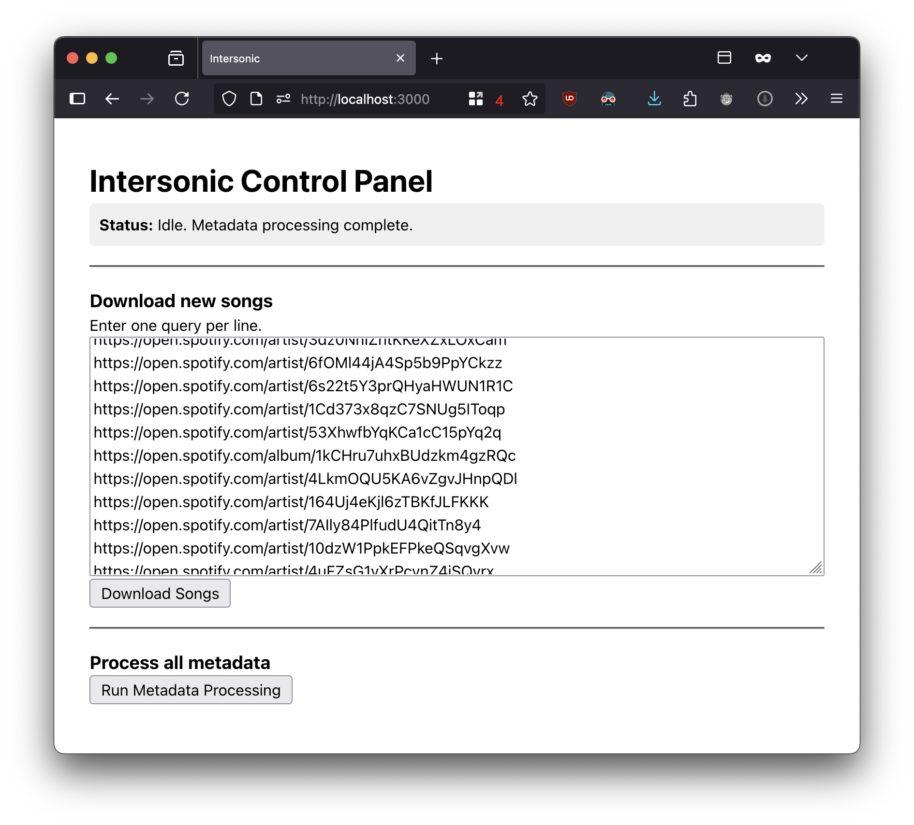

# Intersonic

A self-hosted service to download music and manage its metadata. Built for Navidrome users and other music hoarders.



## What it does

Intersonic is a tool that runs on your server to build a clean, well-organized music library.

- Downloads music: It uses `spotdl` to get song metadata from Spotify, audio from YouTube Music, and lyrics from various sources. You can give it Spotify URLs, YouTube Music URLs, or just plain text to search for a song.
- Cleans metadata: After downloading, it cleans and standardizes the song's metadata.
- Sidecar files: The core principle is to store metadata in files alongside the music track. It creates `.json` files for all ID3 tag information, `.lrc` files for (synced or unsynced) lyrics, and `.jpg`s for album art. This makes it incredibly easy to manually edit a song's details by just changing a text file and syncing the change back into the MP3.

## Why Tailscale?

Services like YouTube often block requests coming from datacenter IPs (where most servers live). To get around this, Intersonic routes all of its traffic through a Tailscale exit node. Learn more about [Tailscale](https://tailscale.com) and [exit nodes](https://tailscale.com/kb/1103/exit-nodes).

This means you can run Intersonic on your server, but have it connect to the internet using your home's residential IP address, avoiding blocks.

## Setup

You need Docker and a Tailscale tailnet with an exit node.

1. Clone the repository:

```bash
git clone https://github.com/jeremy46231/intersonic.git
cd intersonic
```

2. Create an `.env` file: in the project directory and fill it out.

```env
# Absolute path to your music library on the host machine
MUSIC_DIR=/opt/navidrome/music

# Your Tailscale authentication key
# Get one from your Tailscale Admin Console -> Settings -> Keys -> Generate auth key
TS_AUTHKEY=tskey-auth-...

# The *name* of the Tailscale device to use as an exit node
TS_EXIT_NODE=apple-tv

# Your Spotify API credentials
# Get them from the Spotify Developer Dashboard
SPOTIFY_CLIENT_ID=
SPOTIFY_CLIENT_SECRET=

# (Optional) Your Genius API access token for better lyric results
GENIUS_ACCESS_TOKEN=
```

3. Run the application:

```bash
docker-compose up -d
```

You may need to approve the new machine named "intersonic" in your Tailscale admin console before it can connect to your exit node.

## Usage

Open your browser and go to `http://<your-server-ip>:3000`.

To download new music:

- Paste one or more queries (Spotify/YouTube URL or just text) into the large text area, one per line.
- Click **"Download Songs"**.

To process your existing library:

- Click **"Run Metadata Processing"**. This will scan every MP3 in your `MUSIC_DIR` and apply the cleaning and sidecar-file logic.

The status box at the top will show you what the application is doing in real time.

## License

This project is licensed under the MIT License. See the [LICENSE](LICENSE) file for details.

## Contributing

I will happily accept pull requests for fixes, improvements, or features. Keep in mind that this is a personal project that I primarily use for myself, so you might be better off forking and maintaining your own version if you have different needs.
